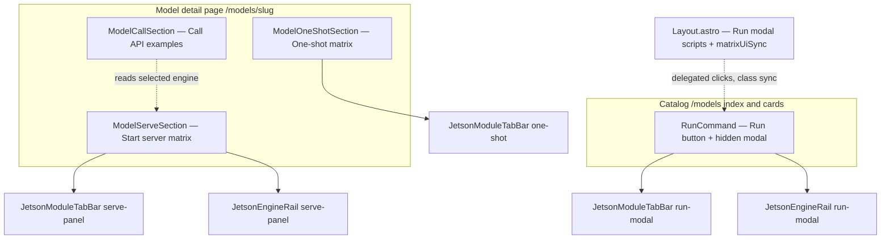

# Jetson matrix UI & Run modal — maintainer guide

This document is for **Jetson AI Lab** maintainers (Jetson TME and contributors). It explains how the **shared “widget”** for Jetson module tabs + engine rail works across the **model detail page**, **catalog Run button**, and **one-shot** flows, and where to change **look** vs **behavior**.

---

## 1. What “the widget” is

We do **not** ship a single Web Component. The single source of truth is a **layered stack**:

| Layer | Role |
|--------|------|
| **Astro building blocks** | `JetsonModuleTabBar` + `JetsonEngineRail` render the same DOM patterns in multiple places. |
| **Tailwind tokens** | `src/components/matrix/matrixTabStyles.ts` holds class strings for SSR markup (Phase 2). |
| **Client sync** | `src/lib/matrixUiSync.ts` applies selection/disabled **classes** in the browser so tabs/rail stay in sync with state (Phase 3). |
| **Data & rules** | `src/lib/inferenceCommands.ts` (serve matrix, module list, commands) and `src/lib/evalRunModal.ts` (one-shot / eval modal). |
| **Global Run logic** | `src/layouts/Layout.astro` handles **delegated clicks**, modal open/close, and Run modal matrix sync (serves every page that embeds `RunCommand`). |

The **five module tabs** (Orin Nano, Orin NX, AGX Orin, Thor T4000, T5000  — as configured in `JETSON_MATRIX_MODULES`) are **data-driven** from `inferenceCommands.ts`, not hard-coded per page.

---

## 2. Where the UI appears (two “surfaces”)

- **Embedded matrix** (full width on the model page): `ModelServeSection` + optional `ModelOneShotSection`.
- **Run modal** (opened from **Run** on the catalog or from pages that include `RunCommand`): same tab/rail **components** with `variant="run-modal"` and different `data-*` attributes so `Layout.astro` can find them.

`ModelCallSection` does **not** render the matrix. It **reads** which engine is selected in the serve panel so generated curl/Python examples can match (`readEngineFromServePanel` → `.engine-rail-btn[aria-selected="true"]` under `[data-inference-matrix-root]`).

---

## 3. How `RunCommand` chooses the modal layout

`RunCommand.astro` receives `supportedEngines`, `matrixModulesDisabled`, `one_shot_inference` (as `oneShotInference`), etc., same idea as the model page.

Decision order (simplified):

1. **`useServeMatrix`** — `visibleModules.length > 0` **and** there is at least one category engine after YAML filtering.
   - Requires `supported_inference_engines` in front matter with `serve_command_*` / matrix-capable entries so `visibleModulesForEngines` returns modules.
   - Modal shows **module tabs + engine rail** (serve / Quick Start Runner).

2. Else **`useEvalMatrix`** — no serve matrix, but `oneShotHasRunModalContent(oneShotInference)` and `evalMatrixModuleSpecs` yield modules.
   - Modal shows **module tabs** for **one-shot / eval** snippets (no engine rail in the same form as serve; engine may be dropdown in legacy branch depending on branch).

3. Else **legacy modal** — device + engine `<select>`, compose/shell/python tabs, etc.
   - Typical when a model has **no** matrix-capable serve data **and** no usable `one_shot_inference` for the eval matrix (e.g. some **VLA** or non–LLM/VLM flows that are not expressed as serve + matrix).

So: **LLM/VLM-style models** with YAML serve commands get the **serve matrix** modal; models with **only** one-shot/eval content get the **eval matrix** modal; others fall back to **legacy** UI.

Model pages also hide the whole “Run on Jetson” stack when `hide_run_button` is set or there are no sorted engines (`[slug].astro`).

---

## 4. Component cheat sheet

| Component | File | Purpose |
|-----------|------|---------|
| **ModelServeSection** | `src/components/ModelServeSection.astro` | “Start server” matrix on the model page. Injects JSON config, `initJetsonInferenceMatrix()` — uses `matrixUiSync` + prefs. |
| **ModelOneShotSection** | `src/components/ModelOneShotSection.astro` | “One-shot inference” matrix on the model page. Separate JSON config and script; uses `syncMatrixModuleTabSelection` for tab chrome. |
| **ModelCallSection** | `src/components/ModelCallSection.astro` | “Call the model over Web API” — examples; syncs with **serve** engine rail selection. |
| **RunCommand** | `src/components/RunCommand.astro` | **Run** button + modal markup; passes `data-meta` JSON into `Layout` for command rendering. Uses shared `JetsonModuleTabBar` / `JetsonEngineRail` when serve matrix is on. |
| **Layout** | `src/layouts/Layout.astro` | Run modal **event delegation** (`data-run-open`, `data-run-module-tab`, `data-run-engine-btn`, …), `syncRunModalMatrixUi`, HF/vLLM visibility, **imports `matrixUiSync`**. |

Shared presentational pieces:

- `src/components/matrix/JetsonModuleTabBar.astro` — `variant`: `serve-panel` | `run-modal` | `one-shot`.
- `src/components/matrix/JetsonEngineRail.astro` — `variant`: `serve-panel` | `run-modal`.
- `src/components/matrix/panelTypes.ts` — small prop types.
- `src/components/matrix/matrixTabStyles.ts` — Tailwind tokens for SSR classes.
- `src/lib/matrixUiSync.ts` — runtime class sync for tabs + engine rail.

---

## 5. Changing the **look** (colors, spacing, borders)

1. **SSR / first paint** (what Astro prints): edit **`matrixTabStyles.ts`** and, only if needed, the thin wrappers **`JetsonModuleTabBar.astro`** / **`JetsonEngineRail.astro`**.
   - Read the **cascade comment** at the top of `matrixTabStyles.ts` (border order, `lg:!border-l-*`, modal `min-w-0`).

2. **After click / engine change** (green selection, disabled gray): edit **`matrixUiSync.ts`** so the same utility names stay aligned with the Astro output. If you add a new class in `matrixTabStyles` for selected state, add the matching `classList.toggle` (or shared constant) in **`matrixUiSync.ts`**.

3. **Modal-only tweaks** (e.g. wrapped tab labels): `JetsonModuleTabBar` already branches `variant === 'run-modal'` for `min-w-0`, `overflow-wrap`, etc. Prefer extending that branch rather than duplicating markup in `RunCommand`.

---

## 6. Changing **behavior** (what gets selected, disabled, persisted)

| Concern | Where to work |
|---------|----------------|
| Which modules appear, command matrix keys | `inferenceCommands.ts` (`JETSON_MATRIX_MODULES`, `visibleModulesForEngines`, `buildCommandMatrix`, …). |
| Disabling a tab globally per model | Front matter `matrix_modules_disabled` → `applyMatrixModuleDisabledFlags`. |
| Eval / one-shot module list & snippets | `evalRunModal.ts` (`evalMatrixModuleSpecs`, `evalSnippetByModule`, …). |
| Serve panel: module/engine selection, copy, vLLM/HF | `ModelServeSection.astro` `<script>` + `inferenceBrowserPrefs`. |
| Run modal: clicks, prefs, matrix sync | `Layout.astro` (search `syncRunModalMatrixUi`, `updateRunModalModuleTabAvailability`). |
| Shared selection/disabled **class** behavior | `matrixUiSync.ts` |

**Do not** rename lightly: `data-module`, `data-run-module-tab`, `.module-tab-btn`, `.engine-rail-btn`, `data-run-engine-btn` are wired to analytics, `ModelCallSection`, and Layout. If you rename, update **all** consumers in the same PR.

---

## 7. Catalog vs model page — duplicate `RunCommand` instances

The models index may render **multiple** `RunCommand` islands (table + cards). `Layout.astro` resolves the modal **next to** the clicked button so the correct modal opens. Keep that pattern if you add new list layouts.

---

## 8. Related internal note

Refactor phases and risks (selectors, table `text-align`, etc.) live in **`.cursor/notes/jetson-matrix-refactor-plan.md`** in the repo; this doc is the **maintainer-facing** overview.

---

## 9. Verifying the shared stack in the browser (F12)

The tab strip and engine rail roots include **maintainer-only data attributes** (no visual change):

| Attribute | Example value | Meaning |
|-----------|----------------|---------|
| `data-jetson-matrix-ui` | `module-tab-bar:serve-panel`, `module-tab-bar:run-modal`, `module-tab-bar:one-shot`, `engine-rail:serve-panel`, `engine-rail:run-modal` | Which shared component instance is rendered. |
| `data-jetson-matrix-revision` | `3` | Bumped when the shared matrix stack contract changes (components + `matrixUiSync`). |

In **Elements**, select the `role="tablist"` row for modules or engines and confirm these attributes. If they are missing, the page is not using `JetsonModuleTabBar` / `JetsonEngineRail` (e.g. legacy Run modal).

---

## 10. Quick checklist for a UI tweak

1. Identify surface: **serve panel**, **Run modal**, or **one-shot** (may share `matrixTabStyles` + `matrixUiSync`).
2. Change **static** classes in `matrixTabStyles.ts` / Astro components.
3. If selection/disabled **animation** or color is wrong after interaction, update **`matrixUiSync.ts`** to match.
4. Run **`npm run dev`** and verify: model page matrix, **Run** from `/models`, and a model with **one-shot** only if you touched eval paths.
5. If you change DOM hooks, grep for old selectors and update **`ModelCallSection`**, **`Layout.astro`**, and **`ModelServeSection`** scripts.

---

*Last updated to reflect Phases 1–3 of the matrix refactor (shared Astro components, `matrixTabStyles`, `matrixUiSync`), plus `data-jetson-matrix-*` markers for verification.*
