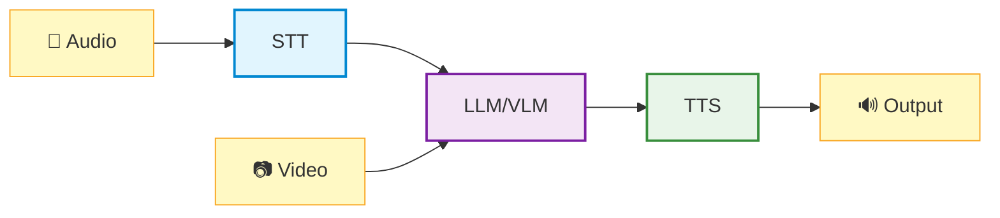

In this chapter, you'll explore voice-driven AI interactions using Multi-modal AI Studio on Jetson Thor.

<Note title="📍 Run on Jetson">
  All commands in this lab should be run in your **Jetson terminal** (SSH session), not on your client PC.
</Note>

---

## Conversation Pipeline

A complete conversation pipeline consists of three core components:

| Component | Function | Example Models |
|-----------|----------|----------------|
| **STT** (Speech to Text) | Converts spoken audio to text | Riva STT, Whisper |
| **LLM/VLM** (Language/Vision Model) | Generates intelligent responses with optional visual understanding | Llama, Qwen, Cosmos-Reason |
| **TTS** (Text-to-Speech) | Converts text responses to natural speech | Riva TTS, Piper |

---

## Multi-modal AI Studio

**Voice, Text, and Video AI Interface with Advanced Performance Analysis**

Multi-modal AI Studio is a next-generation conversational AI interface designed for analyzing and optimizing voice AI systems. Built on NVIDIA Riva, OpenAI APIs, and other backends, it features sophisticated session management, real-time timeline visualization, and comprehensive latency metrics.

### Key Features

- **Voice + Vision**: Combine speech input with live video understanding
- **Real-time Latency Metrics**: See STT, LLM, and TTS timing breakdowns
- **Session Timeline**: Visualize conversation flow and response times
- **Multiple Backends**: Switch between Riva, Whisper, and cloud APIs
- **Performance Analysis**: Optimize your pipeline for production deployment
