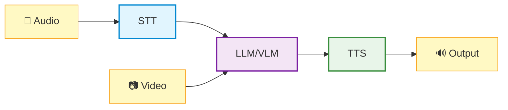

In this chapter, you'll explore voice-driven AI interactions using Multi-modal AI Studio on Jetson Thor.

<Note title="📍 Run on Jetson">
  All commands in this lab should be run in your **Jetson terminal** (SSH session), not on your client PC.
</Note>

## Conversational AI Pipeline

A complete conversational AI pipeline consists of three core components:

<table style="width: 100%; border-collapse: collapse; font-size: 0.95rem;">
<thead>
<tr style="background: #e2e8f0; color: #1e293b;">
<th style="padding: 12px 16px; text-align: left; font-weight: 600;">Component</th>
<th style="padding: 12px 16px; text-align: left; font-weight: 600;">Function</th>
<th style="padding: 12px 16px; text-align: left; font-weight: 600;">Example Models</th>
</tr>
</thead>
<tbody>
<tr style="background: #f8fafc;"><td style="padding: 12px 16px; border-bottom: 1px solid #e2e8f0; font-weight: 500;">STT (Speech to Text)</td><td style="padding: 12px 16px; border-bottom: 1px solid #e2e8f0;">Converts spoken audio to text</td><td style="padding: 12px 16px; border-bottom: 1px solid #e2e8f0;">Riva STT, Whisper</td></tr>
<tr style="background: #ffffff;"><td style="padding: 12px 16px; border-bottom: 1px solid #e2e8f0; font-weight: 500;">LLM/VLM (Language/Vision Model)</td><td style="padding: 12px 16px; border-bottom: 1px solid #e2e8f0;">Generates intelligent responses with optional visual understanding</td><td style="padding: 12px 16px; border-bottom: 1px solid #e2e8f0;">Llama, Qwen, Cosmos-Reason</td></tr>
<tr style="background: #f8fafc;"><td style="padding: 12px 16px; font-weight: 500;">TTS (Text-to-Speech)</td><td style="padding: 12px 16px;">Converts text responses to natural speech</td><td style="padding: 12px 16px;">Riva TTS, Kokoro TTS, Piper TTS</td></tr>
</tbody>
</table>

## Multi-modal AI Studio

**Voice, Text, and Video AI Interface with Advanced Performance Analysis**

Multi-modal AI Studio is a next-generation conversational AI interface designed for analyzing and optimizing voice AI systems. Built on NVIDIA Riva, OpenAI APIs, and other backends, it features sophisticated session management, real-time timeline visualization, and comprehensive latency metrics.

### Key Features

- **Voice + Vision**: Combine speech input with live video understanding
- **Real-time Latency Metrics**: See STT, LLM, and TTS timing breakdowns
- **Session Timeline**: Visualize conversation flow and response times
- **Multiple Backends**: Switch between Riva, Whisper, and cloud APIs
- **Performance Analysis**: Optimize your pipeline for production deployment
