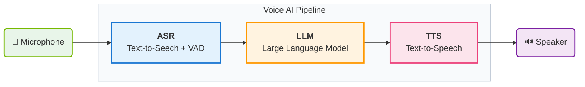
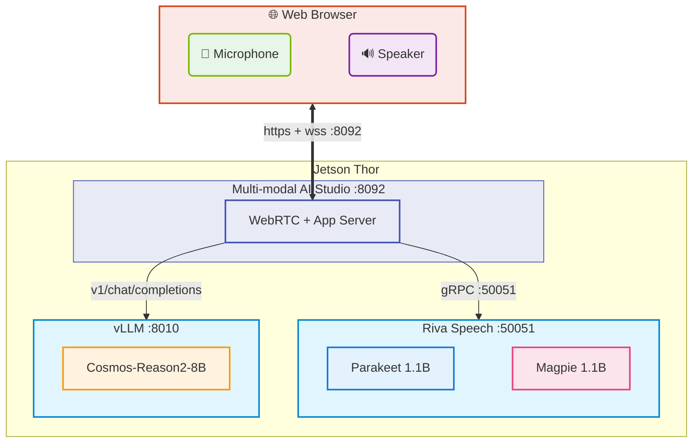

In this chapter, you'll explore voice-driven AI interactions using Multi-modal AI Studio on Jetson Thor.

<Note title="📍 Run on Jetson">
  All commands in this lab should be run in your **Jetson terminal** (SSH session), not on your client PC.
</Note>

## Conversational AI Pipeline

A complete conversational AI pipeline consists of three core components:



<div style="overflow-x: auto; margin: 1.5rem 0;">
<table style="width: 100%; border-collapse: collapse; font-size: 0.95rem;">
<thead>
<tr style="background: #e2e8f0; color: #1e293b;">
<th style="padding: 12px 16px; text-align: left; font-weight: 600;">Component</th>
<th style="padding: 12px 16px; text-align: left; font-weight: 600;">Function</th>
<th style="padding: 12px 16px; text-align: left; font-weight: 600;">Example Models</th>
</tr>
</thead>
<tbody>
<tr style="background: #f8fafc;"><td style="padding: 12px 16px; border-bottom: 1px solid #e2e8f0; font-weight: 500;">ASR (Automatic Speech Recognition)</td><td style="padding: 12px 16px; border-bottom: 1px solid #e2e8f0;">Detects speech activity (VAD) and converts spoken audio to text</td><td style="padding: 12px 16px; border-bottom: 1px solid #e2e8f0;">NVIDIA Parakeet, Whisper</td></tr>
<tr style="background: #ffffff;"><td style="padding: 12px 16px; border-bottom: 1px solid #e2e8f0; font-weight: 500;">LLM/VLM (Language/Vision Model)</td><td style="padding: 12px 16px; border-bottom: 1px solid #e2e8f0;">Generates intelligent responses with optional visual understanding</td><td style="padding: 12px 16px; border-bottom: 1px solid #e2e8f0;">Llama, Qwen, Cosmos-Reason</td></tr>
<tr style="background: #f8fafc;"><td style="padding: 12px 16px; font-weight: 500;">TTS (Text-to-Speech)</td><td style="padding: 12px 16px;">Converts text responses to natural speech</td><td style="padding: 12px 16px;">NVIDIA Magpie, Kokoro TTS, Piper TTS</td></tr>
</tbody>
</table>
</div>

## Multi-modal AI Studio

Multi-modal AI Studio is a **reference application** for building and evaluating speech and vision-enabled AI pipelines on Jetson. It's designed to help you:

1. **Evaluate different backend models** — The pipeline is modular and built on standard web APIs (OpenAI-compatible, Riva's gRPC, etc.), so you can swap ASR, LLM, and TTS backends independently to compare models side by side
2. **Configure the audio pipeline visually** — A GUI lets you easily adjust pipeline parameters like VAD sensitivity, ASR settings, LLM prompts, and TTS voice — no code changes needed
3. **Analyze and minimize latency** — Built-in timeline visualization and per-stage latency metrics help you identify bottlenecks and evaluate strategies to reduce end-to-end response time

### Architectural Setup



## Step 1: Start NVIDIA Riva (ASR + TTS)

NVIDIA Riva provides the ASR and TTS services for the voice pipeline. It runs as a Docker container exposing a gRPC endpoint on port `50051`.

```bash
cd ~/riva_quickstart_arm64_v2.24.0
bash riva_start.sh
```

Wait for the server to be ready. You can monitor the logs:

```bash
docker logs -f riva-speech
```

Look for:
```
Riva server listening on 0.0.0.0:50051
All models loaded successfully
```

This may take 2–5 minutes on first startup as models are loaded into GPU memory.

<Note title="📦 Pre-configured for This Workshop">
  The Riva quickstart bundle is already downloaded, configured, and initialized on your Jetson Thor. You only need to run `riva_start.sh`.

  On your own Jetson, the full setup involves:
  1. Install NGC CLI and configure credentials
  2. Download the Riva ARM64 quickstart (`ngc registry resource download-version nvidia/riva/riva_quickstart_arm64:2.24.0`)
  3. Edit `config.sh` to select ASR/TTS models and Jetson platform
  4. Run `riva_init.sh` to download Docker images and models (~15–45 min)
  5. Run `riva_start.sh`

  See the [NVIDIA Riva documentation](https://docs.nvidia.com/deeplearning/riva/user-guide/docs/quick-start-guide/) for the full setup guide.
</Note>

## Step 2: Start vLLM with Cosmos-Reason2

Next, start the LLM backend. We'll use Cosmos-Reason2 on vLLM again, but on a **different port** — Riva's container occupies ports 8000–8002, so we use **port 8010**.

```bash
sudo sysctl -w vm.drop_caches=3

sudo docker run -it --rm --runtime=nvidia --network host \
  -v ~/models/cosmos-reason2-8b:/models/cosmos-reason2-8b:ro \
  -v ${HOME}/.cache/vllm:/root/.cache/vllm \
  ghcr.io/nvidia-ai-iot/vllm:0.14.0-r38.3-arm64-sbsa-cu130-24.04 \
  vllm serve /models/cosmos-reason2-8b \
    --served-model-name nvidia/cosmos-reason2-8b-fp8 \
    --max-model-len 8192 \
    --gpu-memory-utilization 0.7 \
    --reasoning-parser qwen3 \
    --media-io-kwargs '{"video": {"num_frames": -1}}' \
    --enable-prefix-caching \
    --port 8010
```

Wait for vLLM to be ready:
```
INFO:     Uvicorn running on http://0.0.0.0:8010
```

<Warning title="⚠️ Port Conflict with Riva">
  The Riva container exposes ports **8000–8002** (and 8888, 50051). Always use a different port for vLLM when running alongside Riva. We use `--port 8010` here.
</Warning>

## Step 3: Start Multi-modal AI Studio

In a **new terminal** (keep Riva and vLLM running), start the application:

```bash
cd ~/multi-modal-ai-studio
source .venv/bin/activate

multi-modal-ai-studio --port 8092 \
  --asr-server localhost:50051 \
  --tts-server localhost:50051 \
  --llm-api-base http://localhost:8010/v1 \
  --llm-model nvidia/cosmos-reason2-8b-fp8
```

### Access the Interface

On your **client PC browser**, navigate to:

```
https://<JETSON_IP>:8092
```

Accept the self-signed SSL certificate (same process as Live VLM WebUI — click **Advanced** → **Proceed**).

### Configure the Pipeline

Click **"New Voice Chat"** to activate the configuration panel. Walk through each tab:

#### 1. ASR Tab → Select "NVIDIA Riva"

<div style="overflow-x: auto; margin: 1.5rem 0;">
<table style="width: 100%; border-collapse: collapse; font-size: 0.95rem;">
<thead>
<tr style="background: #e2e8f0; color: #1e293b;">
<th style="padding: 12px 16px; text-align: left; font-weight: 600;">Setting</th>
<th style="padding: 12px 16px; text-align: left; font-weight: 600;">Value</th>
</tr>
</thead>
<tbody>
<tr style="background: #f8fafc;"><td style="padding: 12px 16px; border-bottom: 1px solid #e2e8f0; font-weight: 500;">Server Address</td><td style="padding: 12px 16px; border-bottom: 1px solid #e2e8f0;"><code>localhost:50051</code></td></tr>
<tr style="background: #ffffff;"><td style="padding: 12px 16px; border-bottom: 1px solid #e2e8f0; font-weight: 500;">ASR Language</td><td style="padding: 12px 16px; border-bottom: 1px solid #e2e8f0;"><code>en-US</code></td></tr>
<tr style="background: #f8fafc;"><td style="padding: 12px 16px; font-weight: 500;">ASR Model</td><td style="padding: 12px 16px;"><code>parakeet-1.1b-en-US-asr-streaming-silero-vad-sortformer</code></td></tr>
</tbody>
</table>
</div>

The Silero VAD variant provides better voice activity detection — it detects when you start and stop speaking, so the system knows when to begin transcription and when your turn is over.

#### 2. LLM Tab

<div style="overflow-x: auto; margin: 1.5rem 0;">
<table style="width: 100%; border-collapse: collapse; font-size: 0.95rem;">
<thead>
<tr style="background: #e2e8f0; color: #1e293b;">
<th style="padding: 12px 16px; text-align: left; font-weight: 600;">Setting</th>
<th style="padding: 12px 16px; text-align: left; font-weight: 600;">Value</th>
</tr>
</thead>
<tbody>
<tr style="background: #f8fafc;"><td style="padding: 12px 16px; border-bottom: 1px solid #e2e8f0; font-weight: 500;">API Base URL</td><td style="padding: 12px 16px; border-bottom: 1px solid #e2e8f0;"><code>http://localhost:8010/v1</code></td></tr>
<tr style="background: #ffffff;"><td style="padding: 12px 16px; border-bottom: 1px solid #e2e8f0; font-weight: 500;">Model</td><td style="padding: 12px 16px; border-bottom: 1px solid #e2e8f0;"><code>nvidia/cosmos-reason2-8b-fp8</code></td></tr>
<tr style="background: #f8fafc;"><td style="padding: 12px 16px; border-bottom: 1px solid #e2e8f0; font-weight: 500;">Utility Model</td><td style="padding: 12px 16px; border-bottom: 1px solid #e2e8f0;"><code>nvidia/cosmos-reason2-8b-fp8</code></td></tr>
<tr style="background: #ffffff;"><td style="padding: 12px 16px; border-bottom: 1px solid #e2e8f0; font-weight: 500;">Enable Streaming Responses</td><td style="padding: 12px 16px; border-bottom: 1px solid #e2e8f0;">✅ Checked</td></tr>
<tr style="background: #f8fafc;"><td style="padding: 12px 16px; border-bottom: 1px solid #e2e8f0; font-weight: 500;">Include Conversation History</td><td style="padding: 12px 16px; border-bottom: 1px solid #e2e8f0;">✅ Checked</td></tr>
<tr style="background: #ffffff;"><td style="padding: 12px 16px; border-bottom: 1px solid #e2e8f0; font-weight: 500;">Enable Vision (VLM)</td><td style="padding: 12px 16px; border-bottom: 1px solid #e2e8f0;"><code>Video Input</code></td></tr>
<tr style="background: #f8fafc;"><td style="padding: 12px 16px; font-weight: 500;">System Prompt</td><td style="padding: 12px 16px;">See below</td></tr>
</tbody>
</table>
</div>

Suggested system prompt for concise vision responses:

```
You are a vision assistant. Give ONE short sentence answers only. Be direct. No explanations. Use plain text only — no markdown or formatting.
```

<Note title="📝 Why these settings?">
  - **Streaming Responses** lets TTS start speaking before the full LLM response is generated, reducing perceived latency
  - **Conversation History** gives the LLM context from previous turns, enabling follow-up questions
  - **Vision (Video Input)** captures frames from the camera and includes them in the LLM prompt
  - **System Prompt** shapes the AI's behavior — shorter responses mean faster TTS and a more conversational feel
</Note>

#### 3. TTS Tab

<div style="overflow-x: auto; margin: 1.5rem 0;">
<table style="width: 100%; border-collapse: collapse; font-size: 0.95rem;">
<thead>
<tr style="background: #e2e8f0; color: #1e293b;">
<th style="padding: 12px 16px; text-align: left; font-weight: 600;">Setting</th>
<th style="padding: 12px 16px; text-align: left; font-weight: 600;">Value</th>
</tr>
</thead>
<tbody>
<tr style="background: #f8fafc;"><td style="padding: 12px 16px; border-bottom: 1px solid #e2e8f0; font-weight: 500;">Riva Server</td><td style="padding: 12px 16px; border-bottom: 1px solid #e2e8f0;"><code>localhost:50051</code></td></tr>
<tr style="background: #ffffff;"><td style="padding: 12px 16px; border-bottom: 1px solid #e2e8f0; font-weight: 500;">TTS Model</td><td style="padding: 12px 16px; border-bottom: 1px solid #e2e8f0;"><code>magpie_tts_ensemble_Magpie-Multilingual</code></td></tr>
<tr style="background: #f8fafc;"><td style="padding: 12px 16px; border-bottom: 1px solid #e2e8f0; font-weight: 500;">Language</td><td style="padding: 12px 16px; border-bottom: 1px solid #e2e8f0;">English (US)</td></tr>
<tr style="background: #ffffff;"><td style="padding: 12px 16px; border-bottom: 1px solid #e2e8f0; font-weight: 500;">Sample Rate (Hz)</td><td style="padding: 12px 16px; border-bottom: 1px solid #e2e8f0;"><code>22050</code></td></tr>
<tr style="background: #f8fafc;"><td style="padding: 12px 16px; border-bottom: 1px solid #e2e8f0; font-weight: 500;">Quality</td><td style="padding: 12px 16px; border-bottom: 1px solid #e2e8f0;">High (Better)</td></tr>
<tr style="background: #ffffff;"><td style="padding: 12px 16px; border-bottom: 1px solid #e2e8f0; font-weight: 500;">Start speaking before LLM finishes</td><td style="padding: 12px 16px; border-bottom: 1px solid #e2e8f0;">✅ Checked</td></tr>
<tr style="background: #f8fafc;"><td style="padding: 12px 16px; font-weight: 500;">Words before first speech</td><td style="padding: 12px 16px;"><code>10</code></td></tr>
</tbody>
</table>
</div>

"Start speaking before LLM finishes" is key for low latency — TTS begins synthesizing after the first 10 words arrive from the LLM, rather than waiting for the complete response.

#### 4. Devices Tab

<div style="overflow-x: auto; margin: 1.5rem 0;">
<table style="width: 100%; border-collapse: collapse; font-size: 0.95rem;">
<thead>
<tr style="background: #e2e8f0; color: #1e293b;">
<th style="padding: 12px 16px; text-align: left; font-weight: 600;">Setting</th>
<th style="padding: 12px 16px; text-align: left; font-weight: 600;">Value</th>
</tr>
</thead>
<tbody>
<tr style="background: #f8fafc;"><td style="padding: 12px 16px; border-bottom: 1px solid #e2e8f0; font-weight: 500;">Camera Device</td><td style="padding: 12px 16px; border-bottom: 1px solid #e2e8f0;"><code>Default (browser)</code></td></tr>
<tr style="background: #ffffff;"><td style="padding: 12px 16px; border-bottom: 1px solid #e2e8f0; font-weight: 500;">Microphone Device</td><td style="padding: 12px 16px; border-bottom: 1px solid #e2e8f0;"><code>Default (browser)</code></td></tr>
<tr style="background: #f8fafc;"><td style="padding: 12px 16px; font-weight: 500;">Speaker Device</td><td style="padding: 12px 16px;"><code>Default (browser)</code></td></tr>
</tbody>
</table>
</div>

These use your client PC's browser devices via WebRTC.

#### 5. App Tab

<div style="overflow-x: auto; margin: 1.5rem 0;">
<table style="width: 100%; border-collapse: collapse; font-size: 0.95rem;">
<thead>
<tr style="background: #e2e8f0; color: #1e293b;">
<th style="padding: 12px 16px; text-align: left; font-weight: 600;">Setting</th>
<th style="padding: 12px 16px; text-align: left; font-weight: 600;">Value</th>
</tr>
</thead>
<tbody>
<tr style="background: #f8fafc;"><td style="padding: 12px 16px; border-bottom: 1px solid #e2e8f0; font-weight: 500;">Start sessions with microphone muted</td><td style="padding: 12px 16px; border-bottom: 1px solid #e2e8f0;">❌ Unchecked</td></tr>
<tr style="background: #ffffff;"><td style="padding: 12px 16px; border-bottom: 1px solid #e2e8f0; font-weight: 500;">Barge-in</td><td style="padding: 12px 16px; border-bottom: 1px solid #e2e8f0;">❌ Unchecked</td></tr>
<tr style="background: #f8fafc;"><td style="padding: 12px 16px; font-weight: 500;">Session Directory</td><td style="padding: 12px 16px;"><code>Default (sessions)</code></td></tr>
</tbody>
</table>
</div>

### Start a Session

1. Press **"Start Session"**
2. Start speaking — watch the **timeline** at the bottom as it visualizes each stage:
   - 🔵 **ASR** transcribing your speech
   - 🟠 **LLM** generating a response
   - 🔴 **TTS** synthesizing audio
3. When done, click the **red stop button** to end the session
4. Review your session by clicking it in the **session history** sidebar — you'll see the full transcript, timeline, and latency metrics

## 🚑 Troubleshooting

<details>
<summary>`bash: multi-modal-ai-studio: command not found`</summary>

You need to activate the Python virtual environment first:

```bash
cd ~/multi-modal-ai-studio
source .venv/bin/activate
```

Then re-run the `multi-modal-ai-studio` command.

</details>

<details>
<summary>ASR transcription does not start after muting for a while</summary>

The ASR engine times out when it stops receiving audio data for an extended period. Unmuting won't resume transcription in the current session. Click the **red stop button** to end the session, then press **"Start Session"** again to begin a fresh one.

</details>

<details>
<summary>`OSError: [Errno 98] error while attempting to bind on address ('0.0.0.0', 8092): address already in use`</summary>

The application is already running on port 8092. Kill the existing process first:

```bash
fuser -k 8092/tcp
```

Then restart the application.

</details>

<details>
<summary>GPU memory not released after stopping vLLM</summary>

Even after stopping the vLLM container, GPU memory may remain allocated. Run:

```bash
sudo sysctl -w vm.drop_caches=3
```

</details>

## More Things to Try

- **Change the system prompt** — Try a fun personality like: *"You are a cat. You are the smartest cat in the world and can assist the user with anything, but you do it in a playful feline manner while behaving like a cute lovable cat."*
- **Enable Barge-in** (App tab) — Interrupt the AI mid-speech and see how the pipeline handles it
- **Press `f`** to make the video preview full screen (`h` for help with keyboard shortcuts)
- **Turn off "Start speaking before LLM finishes"** — Compare the timeline to see how much latency this feature saves
- **Try the server camera** — Hook up a USB camera to Jetson and select it under Devices
- **Save a preset** — Once you find a configuration you like, save it as a preset for quick recall
