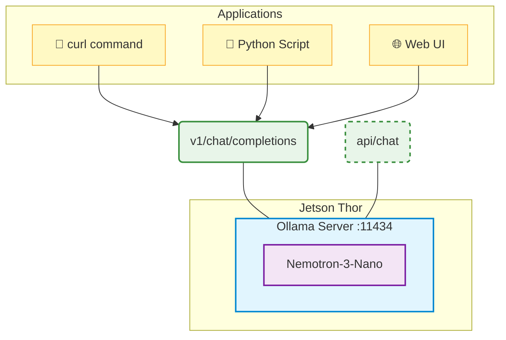
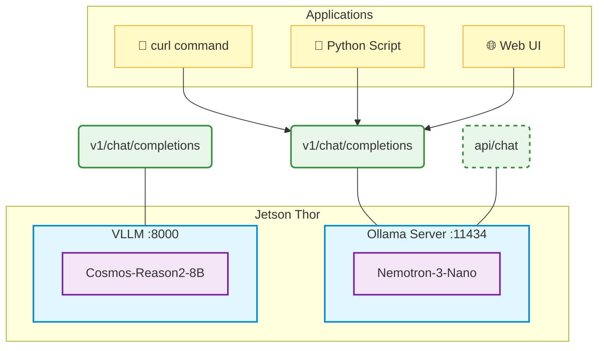

import Tabs from '../../components/Tabs.astro';

In this chapter, you'll learn about AI microservices architecture and how to deploy inference services on Jetson Thor using Ollama with an OpenAI-compatible API.

<Note title="📍 Run on Jetson">
  All commands in this lab should be run in your **Jetson terminal** (SSH session), not on your client PC.
</Note>

## What are AI Microservices?

AI microservices package AI models as **standalone services** with standardized APIs. Instead of embedding models directly into applications, you deploy them as independent services that applications can call.

### Why Microservices for Edge AI?

<div style="overflow-x: auto; margin: 1.5rem 0;">
<table style="width: 100%; border-collapse: collapse; font-size: 0.95rem;">
<thead>
<tr style="background: #e2e8f0; color: #1e293b;">
<th style="padding: 12px 16px; text-align: left; font-weight: 600;">Traditional Approach</th>
<th style="padding: 12px 16px; text-align: left; font-weight: 600;">Microservices Approach</th>
</tr>
</thead>
<tbody>
<tr style="background: #f8fafc;"><td style="padding: 12px 16px; border-bottom: 1px solid #e2e8f0;">Model embedded in app</td><td style="padding: 12px 16px; border-bottom: 1px solid #e2e8f0;">Model runs as separate service</td></tr>
<tr style="background: #ffffff;"><td style="padding: 12px 16px; border-bottom: 1px solid #e2e8f0;">Rebuild app to update model</td><td style="padding: 12px 16px; border-bottom: 1px solid #e2e8f0;">Update model independently</td></tr>
<tr style="background: #f8fafc;"><td style="padding: 12px 16px; border-bottom: 1px solid #e2e8f0;">One app = one model</td><td style="padding: 12px 16px; border-bottom: 1px solid #e2e8f0;">Many apps share one model</td></tr>
<tr style="background: #ffffff;"><td style="padding: 12px 16px;">Custom API per model</td><td style="padding: 12px 16px;">Standardized API (OpenAI-compatible)</td></tr>
</tbody>
</table>
</div>

## Ollama as an AI Microservice

[Ollama](https://ollama.com/) makes it easy to run LLMs and VLMs locally as microservices with an **OpenAI-compatible API**.

### Why Ollama on Jetson Thor?

- **Simple deployment**: One command to download and run models
- **OpenAI API**: Drop-in replacement for cloud APIs on port 11434
- **Model management**: Easy to pull, list, and switch models
- **Low overhead**: Lightweight server optimized for edge devices

## Step 1: Verify Ollama is Running

Ollama is pre-installed on your Jetson Thor. Let's verify it's working.

```bash
ollama --version
```

<details class="nv-details">
<summary>💡 If Ollama is not installed</summary>
<div class="nv-details-content">

**Linux / macOS:**
```bash
curl -fsSL https://ollama.com/install.sh | sh
```

**Windows (PowerShell):**
```powershell
irm https://ollama.com/install.ps1 | iex
```

</div>
</details>

### List Available Models

```bash
ollama list
```

## Step 2: Run a Model Interactively

Start a chat session with Nemotron-3-Nano (pre-installed on your Jetson Thor):

```bash
ollama run nemotron-3-nano:latest
```

Try a prompt:

```
>>> Explain Physical AI in one sentence.
```

Press `Ctrl+D` or type `/bye` to exit.

## Step 3: Test the API

Ollama runs an OpenAI-compatible API server on port **11434**.

### List Available Models via API

```bash
curl http://localhost:11434/v1/models
```

### Chat Completion Request

```bash
curl -X POST http://localhost:11434/v1/chat/completions \
  -H "Content-Type: application/json" \
  -d '{
    "model": "nemotron-3-nano:latest",
    "messages": [
      {"role": "user", "content": "Explain Physical AI in one sentence."}
    ],
    "max_tokens": 100
  }'
```

You'll receive a JSON response with the model's completion.

<Tip title="💡 OpenAI-Compatible">
  This is the same API format used by OpenAI's GPT models — see the [OpenAI Chat Completions API reference](https://developers.openai.com/api/reference/resources/chat/subresources/completions/methods/create). Any application built for OpenAI can work with your local Ollama server!
</Tip>

## Architecture Overview

Here's how AI microservices work — the model runs as a server that exposes an API endpoint, and any application can interact with it through standard HTTP requests:

<Tabs labels={["Ollama Only", "Ollama + vLLM"]}>
  <div class="nv-tab-panel active">



  </div>
  <div class="nv-tab-panel">



  </div>
</Tabs>

Multiple applications can share the same inference service, reducing resource usage and simplifying deployment.

## Step 4: Open WebUI — Chat Interface

Now let's connect a web-based chat interface to your Ollama microservice. This demonstrates how any application can use the OpenAI-compatible API.

### Launch Open WebUI

```bash
docker run -d --network=host \
    -v ${HOME}/open-webui:/app/backend/data \
    -e OLLAMA_BASE_URL=http://127.0.0.1:11434 \
    --name open-webui \
    ghcr.io/open-webui/open-webui:main
```

### Access the Interface

Open a browser and navigate to:

```
http://<JETSON_IP>:8080
```

### Quick Setup

1. Click **"Get started"** on the welcome screen
2. Create an account (e.g., `jetson@jetson.com` / `jetson`)
3. Select **nemotron-3-nano:latest** from the model dropdown
4. Start chatting with your local model!


<Note title="🔒 Privacy">
  All account information stays local — nothing is verified or stored externally. Your data never leaves your Jetson.
</Note>

<Tip title="💡 Why Open WebUI?">
  This shows the power of microservices: Ollama runs the model, Open WebUI provides the interface, and they communicate via the standard OpenAI API. You can swap either component independently.
</Tip>

### Bonus Challenge: Try a Vision Language Model (VLM)

Ollama's [model library](https://ollama.com/library) includes many vision-capable models — these are **Vision Language Models (VLMs)** that can understand both text and images.

Challenge yourself to quickly get a VLM running and use it through Open WebUI:

1. Pull a vision-capable model:
   ```bash
   ollama pull gemma3:4b
   ```
2. In Open WebUI, select **gemma3:4b** from the model dropdown
3. Attach an image file to your message and ask the model to describe it — you're running multimodal AI locally on your Jetson!

<Note title="📝 Gemma3 Vision Support">
  `gemma3` supports vision input at **4B and above** (4B, 12B, 27B). The 1B variant does not support image input.
</Note>

Notice that Open WebUI only lets you upload **static images** one at a time. What if you wanted to continuously feed a live camera stream into a VLM — for real-time video understanding? There's no built-in way to do that here. <br/>**That's exactly what we'll tackle in the next chapter!**


## Before Moving to Chapter 2

### Stop Open WebUI (Optional)

In the next chapter, we don't use Open WebUI, so you can stop the container:

```bash
docker stop open-webui
docker rm open-webui
```

Before starting the next chapter (which uses vLLM), stop Ollama to free up GPU memory:

```bash
sudo systemctl stop ollama
```

Verify it's stopped:

```bash
nvidia-smi
```

You should see no Ollama processes using GPU memory.

<Tip title="💡 GPU Memory">
  For best GPU utilization, stop Ollama before starting vLLM in the next lab. Running both simultaneously splits VRAM between them.
</Tip>
