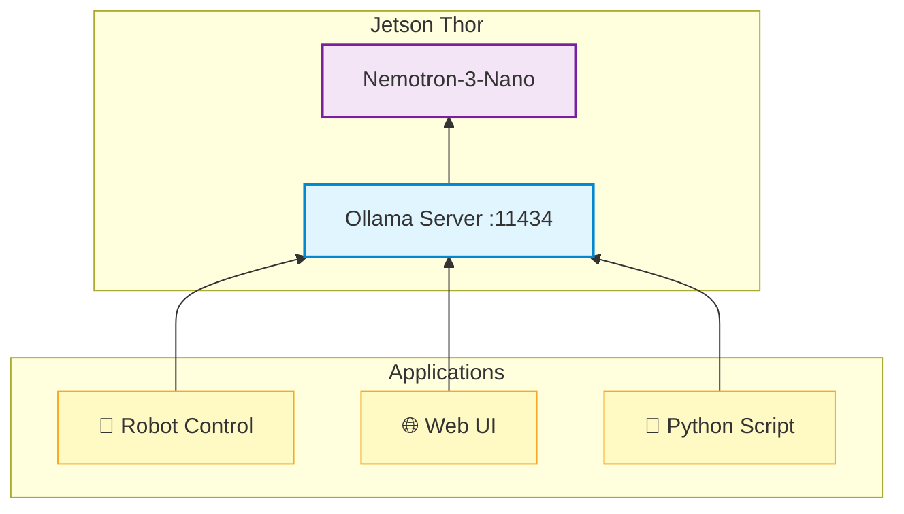

In this chapter, you'll learn about AI microservices architecture and how to deploy inference services on Jetson Thor using Ollama with an OpenAI-compatible API.

<Note title="📍 Run on Jetson">
  All commands in this lab should be run in your **Jetson terminal** (SSH session), not on your client PC.
</Note>

---

## What are AI Microservices?

AI microservices package AI models as **standalone services** with standardized APIs. Instead of embedding models directly into applications, you deploy them as independent services that applications can call.

### Why Microservices for Edge AI?

| Traditional Approach | Microservices Approach |
|---------------------|------------------------|
| Model embedded in app | Model runs as separate service |
| Rebuild app to update model | Update model independently |
| One app = one model | Many apps share one model |
| Custom API per model | Standardized API (OpenAI-compatible) |

---

## Ollama as an AI Microservice

[Ollama](https://ollama.com/) makes it easy to run LLMs and VLMs locally as microservices with an **OpenAI-compatible API**.

### Why Ollama on Jetson Thor?

- **Simple deployment**: One command to download and run models
- **OpenAI API**: Drop-in replacement for cloud APIs on port 11434
- **Model management**: Easy to pull, list, and switch models
- **Low overhead**: Lightweight server optimized for edge devices

---

## Step 1: Verify Ollama is Running

Ollama is pre-installed on your Jetson Thor. Let's verify it's working.

```bash
ollama --version
```

### List Available Models

```bash
ollama list
```

---

## Step 2: Run a Model Interactively

Start a chat session with Nemotron-3-Nano (pre-installed on your Jetson Thor):

```bash
ollama run nemotron-3-nano:latest
```

Try a prompt:

```
>>> What sensors does a robot need for navigation?
```

Press `Ctrl+D` or type `/bye` to exit.

---

## Step 3: Test the API

Ollama runs an OpenAI-compatible API server on port **11434**.

### List Available Models via API

```bash
curl http://localhost:11434/v1/models
```

### Chat Completion Request (with Streaming)

```bash
curl -X POST http://localhost:11434/v1/chat/completions \
  -H "Content-Type: application/json" \
  -d '{
    "model": "nemotron-3-nano:latest",
    "messages": [
      {"role": "user", "content": "Explain Physical AI in one sentence."}
    ],
    "stream": true,
    "max_tokens": 256
  }'
```

You'll see tokens appear one by one — essential for responsive user interfaces and real-time feedback.

<Tip title="💡 OpenAI-Compatible">
  This is the same API format used by OpenAI's GPT models. Any application built for OpenAI can work with your local Ollama server!
</Tip>

---

## Architecture Overview

Here's how AI microservices fit into an edge AI system:



Multiple applications can share the same inference service, reducing resource usage and simplifying deployment.

---

## Before Moving to Lab 2

Before starting the next lab (which uses vLLM), stop Ollama to free up GPU memory:

```bash
sudo systemctl stop ollama
```

Verify it's stopped:

```bash
nvidia-smi
```

You should see no Ollama processes using GPU memory.

<Tip title="💡 GPU Memory">
  For best GPU utilization, stop Ollama before starting vLLM in the next lab. Running both simultaneously splits VRAM between them.
</Tip>
