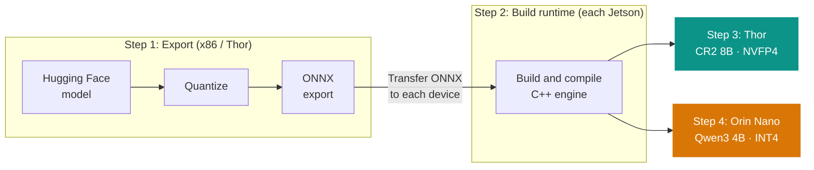
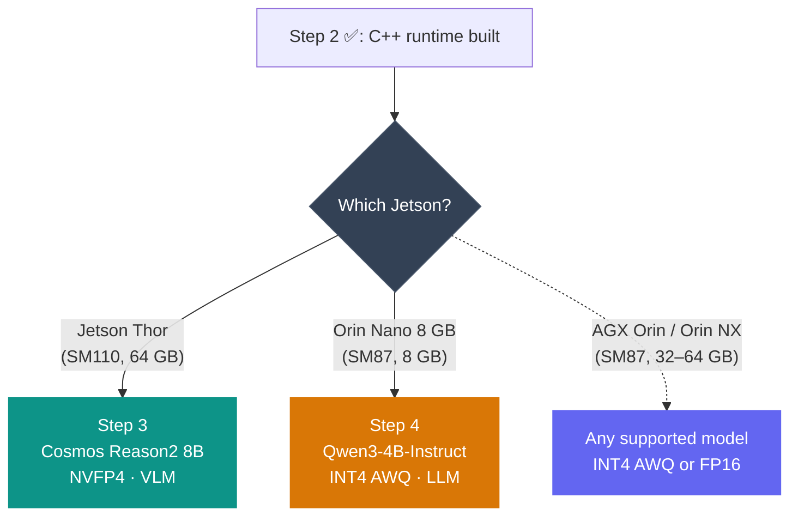

import Tabs from '../../../components/Tabs.astro';

# TensorRT Edge-LLM on Jetson

[TensorRT Edge-LLM](https://github.com/NVIDIA/TensorRT-Edge-LLM) is NVIDIA's high-performance **C++ inference runtime** for LLMs and VLMs on embedded platforms. The workflow compiles trained models into optimized TensorRT engines; at run time, a small native binary loads those engines and serves requests with **no Python interpreter in the inference path**. Quantization (INT4, NVFP4, FP8) reduces weight footprint so larger models remain practical on memory-constrained devices. The SDK supports a wide range of models; see the full [Supported Models](https://github.com/NVIDIA/TensorRT-Edge-LLM/blob/main/docs/source/user_guide/getting_started/supported-models.md) list.

## Overview

Edge-LLM supports a wide range of LLMs and VLMs across the entire Jetson family, from Orin Nano to Thor. See the full [Supported Models](https://github.com/NVIDIA/TensorRT-Edge-LLM/blob/main/docs/source/user_guide/getting_started/supported-models.md) list. In this tutorial, we walk through two examples that showcase the spectrum:

| Model | Type | Parameters | Quantization | Target Device |
|-------|------|------------|-------------|---------------|
| [Cosmos-Reason2-8B](https://huggingface.co/nvidia/Cosmos-Reason2-8B) | VLM | 8B | NVFP4 | Jetson Thor |
| [Qwen3-4B-Instruct](https://huggingface.co/Qwen/Qwen3-4B-Instruct-2507) | LLM | 4B | INT4 AWQ | Jetson Orin Nano 8 GB |

The workflow:

<div class="mermaid-diagram">



</div>

1. **Step 1: Export models** (Python, x86 or Thor). Quantize and convert HuggingFace models to portable ONNX files. Transfer them to your target Jetson(s).
2. **Step 2: Build the C++ runtime** (each Jetson). Clone the repo, compile the C++ engine builder and inference binary. TensorRT engines are hardware-specific and **must be built on the device that will run them**.
3. **Step 3: Cosmos Reason2 8B on Thor** (NVFP4). Build engines and run VLM inference on Jetson Thor.
4. **Step 4: Qwen3-4B-Instruct on Orin Nano** (INT4 AWQ). Build engines and run LLM inference on Jetson Orin Nano 8 GB.

## Prerequisites

### x86 Host / Jetson Thor (for Step 1: Model Export)

<div style="overflow-x: auto; margin: 0.75rem 0 1.75rem;">
<table style="width: 100%; border-collapse: collapse; font-size: 0.95rem; border: 1px solid #e2e8f0; border-radius: 0.5rem; overflow: hidden;">
<thead>
<tr style="background: #e2e8f0; color: #1e293b;">
<th style="padding: 12px 16px; text-align: left; font-weight: 600; width: 28%;">Requirement</th>
<th style="padding: 12px 16px; text-align: left; font-weight: 600;">Details</th>
</tr>
</thead>
<tbody>
<tr style="background: #f8fafc;"><td style="padding: 12px 16px; border-bottom: 1px solid #e2e8f0; font-weight: 600; color: #334155;">OS</td><td style="padding: 12px 16px; border-bottom: 1px solid #e2e8f0;">Ubuntu 22.04 or 24.04</td></tr>
<tr style="background: #ffffff;"><td style="padding: 12px 16px; border-bottom: 1px solid #e2e8f0; font-weight: 600; color: #334155;">GPU</td><td style="padding: 12px 16px; border-bottom: 1px solid #e2e8f0;">NVIDIA GPU with Compute Capability 8.0+ (Ampere or newer)</td></tr>
<tr style="background: #f8fafc;"><td style="padding: 12px 16px; border-bottom: 1px solid #e2e8f0; font-weight: 600; color: #334155;">GPU VRAM</td><td style="padding: 12px 16px; border-bottom: 1px solid #e2e8f0;">24 GB+ recommended (48 GB+ for FP8 export of 8B models)</td></tr>
<tr style="background: #ffffff;"><td style="padding: 12px 16px; border-bottom: 1px solid #e2e8f0; font-weight: 600; color: #334155;">CUDA</td><td style="padding: 12px 16px; border-bottom: 1px solid #e2e8f0;">12.x or 13.x</td></tr>
<tr style="background: #f8fafc;"><td style="padding: 12px 16px; border-bottom: 1px solid #e2e8f0; font-weight: 600; color: #334155;">Python</td><td style="padding: 12px 16px; border-bottom: 1px solid #e2e8f0;">3.10+</td></tr>
<tr style="background: #ffffff;"><td style="padding: 12px 16px; font-weight: 600; color: #334155;">Docker</td><td style="padding: 12px 16px;">Optional but recommended</td></tr>
</tbody>
</table>
</div>

### Jetson Target Device (for Step 2: Build and Inference)

<div style="overflow-x: auto; margin: 0.75rem 0 1.25rem;">
<table style="width: 100%; border-collapse: collapse; font-size: 0.95rem; border: 1px solid #e2e8f0; border-radius: 0.5rem; overflow: hidden;">
<thead>
<tr style="background: #e2e8f0; color: #1e293b;">
<th style="padding: 12px 16px; text-align: left; font-weight: 600; width: 26%;">Requirement</th>
<th style="padding: 12px 16px; text-align: left; font-weight: 600;">Jetson Orin (AGX Orin / Orin NX / Orin Nano)</th>
<th style="padding: 12px 16px; text-align: left; font-weight: 600;">Thor</th>
</tr>
</thead>
<tbody>
<tr style="background: #f8fafc;"><td style="padding: 12px 16px; border-bottom: 1px solid #e2e8f0; font-weight: 600; color: #334155;">JetPack</td><td style="padding: 12px 16px; border-bottom: 1px solid #e2e8f0;">6.2.x</td><td style="padding: 12px 16px; border-bottom: 1px solid #e2e8f0;">7.1</td></tr>
<tr style="background: #ffffff;"><td style="padding: 12px 16px; border-bottom: 1px solid #e2e8f0; font-weight: 600; color: #334155;">CUDA</td><td style="padding: 12px 16px; border-bottom: 1px solid #e2e8f0;">12.6 (included)</td><td style="padding: 12px 16px; border-bottom: 1px solid #e2e8f0;">13.x (included)</td></tr>
<tr style="background: #f8fafc;"><td style="padding: 12px 16px; border-bottom: 1px solid #e2e8f0; font-weight: 600; color: #334155;">TensorRT</td><td style="padding: 12px 16px; border-bottom: 1px solid #e2e8f0;">10.x+ (included)</td><td style="padding: 12px 16px; border-bottom: 1px solid #e2e8f0;">10.x+ (included)</td></tr>
<tr style="background: #ffffff;"><td style="padding: 12px 16px; font-weight: 600; color: #334155;">Storage</td><td style="padding: 12px 16px;">20–50 GB free (ONNX + engines)</td><td style="padding: 12px 16px;">20–50 GB free</td></tr>
</tbody>
</table>
</div>

## Quantization and Platform Compatibility

<div style="overflow-x: auto; margin: 1.5rem 0;">
<table style="width: 100%; border-collapse: collapse; font-size: 0.95rem;">
<thead>
<tr style="background: #e2e8f0; color: #1e293b;">
<th style="padding: 12px 16px; text-align: left; font-weight: 600;">Precision</th>
<th style="padding: 12px 16px; text-align: left; font-weight: 600;">Memory savings<br/><span style="font-weight: 500; font-size: 0.85em;">(vs FP16)</span></th>
<th style="padding: 12px 16px; text-align: left; font-weight: 600;">Jetson Orin<br/><span style="font-weight: 500; font-size: 0.85em;">CC 8.7 (<code>sm_87</code>)</span></th>
<th style="padding: 12px 16px; text-align: left; font-weight: 600;">Jetson Thor<br/><span style="font-weight: 500; font-size: 0.85em;"><code>sm_110</code></span></th>
</tr>
</thead>
<tbody>
<tr style="background: #f8fafc;"><td style="padding: 12px 16px; border-bottom: 1px solid #e2e8f0; font-weight: 500;">FP16</td><td style="padding: 12px 16px; border-bottom: 1px solid #e2e8f0;">Baseline</td><td style="padding: 12px 16px; border-bottom: 1px solid #e2e8f0;">Supported</td><td style="padding: 12px 16px; border-bottom: 1px solid #e2e8f0;">Supported</td></tr>
<tr style="background: #ffffff;"><td style="padding: 12px 16px; border-bottom: 1px solid #e2e8f0; font-weight: 500;">FP8</td><td style="padding: 12px 16px; border-bottom: 1px solid #e2e8f0;">2x reduction</td><td style="padding: 12px 16px; border-bottom: 1px solid #e2e8f0;">Not available</td><td style="padding: 12px 16px; border-bottom: 1px solid #e2e8f0;">Supported</td></tr>
<tr style="background: #f8fafc;"><td style="padding: 12px 16px; border-bottom: 1px solid #e2e8f0; font-weight: 500;">INT4 AWQ</td><td style="padding: 12px 16px; border-bottom: 1px solid #e2e8f0;">4x reduction</td><td style="padding: 12px 16px; border-bottom: 1px solid #e2e8f0;">Supported</td><td style="padding: 12px 16px; border-bottom: 1px solid #e2e8f0;">Supported</td></tr>
<tr style="background: #ffffff;"><td style="padding: 12px 16px; font-weight: 500;">NVFP4</td><td style="padding: 12px 16px;">4x reduction</td><td style="padding: 12px 16px;">Not available</td><td style="padding: 12px 16px;">Supported</td></tr>
</tbody>
</table>
</div>

## Step 1: Export Models (x86 Host or Jetson Thor)

This step converts HuggingFace models to quantized ONNX files. It requires significant GPU memory and Python, so it runs on either an **x86 workstation** or **Jetson Thor**, not on Orin devices.

- **x86 workstation**: use this if you have a Linux PC or cloud GPU. After export, transfer the ONNX files to your Jetson.
- **Jetson Thor**: run the export directly on Thor using the [NVIDIA PyTorch container](https://catalog.ngc.nvidia.com/orgs/nvidia/containers/pytorch). No separate PC needed.

### 1.1 Set Up the Environment

<Tabs labels={["Jetson Thor (Docker)", "x86 Host (Docker)", "x86 Host (venv)"]}>
<div class="nv-tab-panel active">

On Thor, use the [NVIDIA PyTorch container](https://catalog.ngc.nvidia.com/orgs/nvidia/containers/pytorch) which ships with **PyTorch, CUDA, TensorRT, and ModelOpt** pre-installed for Jetson's aarch64/SBSA architecture.

```bash
docker pull nvcr.io/nvidia/pytorch:25.12-py3

docker run -it --runtime nvidia \
    --name edgellm-export \
    -v $(pwd):/workspace \
    -w /workspace \
    nvcr.io/nvidia/pytorch:25.12-py3 \
    bash
```

Inside the container, clone the repository and install. The `--system-site-packages` flag lets the venv inherit the container's NVIDIA-built PyTorch. We install Edge-LLM with `--no-deps` to prevent pip from replacing torch, then install the remaining dependencies separately while filtering out the torch lines.

```bash
git clone https://github.com/NVIDIA/TensorRT-Edge-LLM.git
cd TensorRT-Edge-LLM
git submodule update --init --recursive

python3 -m venv --system-site-packages venv
source venv/bin/activate

pip3 install --no-deps .
sed '/^torch/d' requirements.txt > /tmp/reqs.txt
pip3 install -r /tmp/reqs.txt
```

If you are tempted to run a normal `pip install` instead, see [Troubleshooting](#troubleshooting) (first item: why plain pip breaks on Jetson).

Set the workspace directory to `/workspace/` so exported files land directly on the host via the volume mount:

```bash
export WORKSPACE_DIR=/workspace/tensorrt-edgellm-workspace
```

<div class="admonition warning">
<p class="admonition-title">Use /workspace, not $HOME</p>
<p>Inside the container <code>$HOME</code> is <code>/root</code>, which is <strong>not</strong> on the mounted volume. Always use <code>/workspace/...</code> so your ONNX files appear on the host automatically. When you <code>exit</code> the container, the workspace will be at <code>~/tensorrt-edgellm-workspace</code> (or wherever you ran <code>docker run</code> from).</p>
</div>

</div>

<div class="nv-tab-panel">

Pull and launch the [NVIDIA PyTorch container](https://catalog.ngc.nvidia.com/orgs/nvidia/containers/pytorch):

```bash
docker pull nvcr.io/nvidia/pytorch:25.12-py3

docker run --gpus all -it \
    --name edgellm-export \
    -v $(pwd):/workspace \
    -w /workspace \
    nvcr.io/nvidia/pytorch:25.12-py3 \
    bash
```

Inside the container, clone the repository and install:

```bash
git clone https://github.com/NVIDIA/TensorRT-Edge-LLM.git
cd TensorRT-Edge-LLM
git submodule update --init --recursive

python3 -m venv venv
source venv/bin/activate
pip3 install .
```

</div>

<div class="nv-tab-panel">

If you prefer not to use Docker, set up a virtual environment directly on your x86 host:

```bash
git clone https://github.com/NVIDIA/TensorRT-Edge-LLM.git
cd TensorRT-Edge-LLM
git submodule update --init --recursive

python3 -m venv venv
source venv/bin/activate
pip3 install .
```

</div>
</Tabs>

### 1.2 Verify Installation

```bash
tensorrt-edgellm-export-llm --help
tensorrt-edgellm-quantize-llm --help
```

Both commands should print their usage information without errors.

### 1.3 Log in to HuggingFace

Cosmos-Reason2-8B is a **gated model**: you must accept the license and authenticate before downloading.

1. Visit [nvidia/Cosmos-Reason2-8B](https://huggingface.co/nvidia/Cosmos-Reason2-8B) on HuggingFace and click **"Agree and access repository"**.
2. Generate a token at [HuggingFace Settings - Tokens](https://huggingface.co/settings/tokens) (read access is sufficient).
3. Log in from the terminal:

```bash
huggingface-cli login
```

Paste your token when prompted. This persists across sessions inside the container.

### 1.4 Export Cosmos-Reason2-8B (VLM)

Cosmos Reason2 is a vision-language model, so you need to export **two** components: the language model and the visual encoder.

```bash
# Thor Docker users: WORKSPACE_DIR was already set to /workspace/tensorrt-edgellm-workspace in Step 1.1
# x86 / venv users: set it now
export WORKSPACE_DIR=${WORKSPACE_DIR:-$HOME/tensorrt-edgellm-workspace}
export MODEL_NAME=Cosmos-Reason2-8B
mkdir -p $WORKSPACE_DIR && cd $WORKSPACE_DIR
```

#### Quantize the Language Model

<Tabs labels={["NVFP4 (Thor, recommended)", "INT4 AWQ (Orin / Thor)", "FP8 (Thor / x86 Dev GPU)"]}>
<div class="nv-tab-panel active">

NVFP4 is the recommended precision for Thor (SM110+), offering 4x memory reduction with native hardware support.

```bash
tensorrt-edgellm-quantize-llm \
    --model_dir nvidia/Cosmos-Reason2-8B \
    --output_dir $MODEL_NAME/quantized \
    --quantization nvfp4
```

</div>

<div class="nv-tab-panel">

INT4 AWQ reduces the 8B language-model weights to roughly 4 GB. Use it when deploying on Orin devices (SM87) or Thor.

```bash
tensorrt-edgellm-quantize-llm \
    --model_dir nvidia/Cosmos-Reason2-8B \
    --output_dir $MODEL_NAME/quantized \
    --quantization int4_awq
```

</div>

<div class="nv-tab-panel">

FP8 requires SM89+ at build time. Use this if your target is Thor or an Ada Lovelace+ dev GPU.

```bash
tensorrt-edgellm-quantize-llm \
    --model_dir nvidia/Cosmos-Reason2-8B \
    --output_dir $MODEL_NAME/quantized \
    --quantization fp8
```

</div>
</Tabs>

#### Export Language Model to ONNX

```bash
tensorrt-edgellm-export-llm \
    --model_dir $MODEL_NAME/quantized \
    --output_dir $MODEL_NAME/onnx/llm
```

#### Export Visual Encoder to ONNX

The visual encoder is exported from the original (unquantized) model directory:

```bash
tensorrt-edgellm-export-visual \
    --model_dir nvidia/Cosmos-Reason2-8B \
    --output_dir $MODEL_NAME/onnx/visual
```

### 1.5 Export Qwen3-4B-Instruct (LLM)

Qwen3-4B-Instruct is a text-only LLM. It supports INT4 AWQ, which brings the 4B model down to ~2 GB of weights, a comfortable fit for Orin Nano's 8 GB unified memory. No HuggingFace login is needed (Apache 2.0 license).

```bash
# Thor Docker users: WORKSPACE_DIR was already set to /workspace/tensorrt-edgellm-workspace in Step 1.1
# x86 / venv users: set it now
export WORKSPACE_DIR=${WORKSPACE_DIR:-$HOME/tensorrt-edgellm-workspace}
export MODEL_NAME=Qwen3-4B-Instruct
mkdir -p $WORKSPACE_DIR && cd $WORKSPACE_DIR
```

#### Quantize and Export

<Tabs labels={["INT4 AWQ (Orin Nano, recommended)", "FP8 (Thor / x86 Dev GPU)", "NVFP4 (Thor Only)"]}>
<div class="nv-tab-panel active">

INT4 AWQ reduces the 4B model to ~2 GB of weights, leaving plenty of headroom for KV cache on Orin Nano.

```bash
tensorrt-edgellm-quantize-llm \
    --model_dir Qwen/Qwen3-4B-Instruct-2507 \
    --output_dir $MODEL_NAME/quantized \
    --quantization int4_awq

tensorrt-edgellm-export-llm \
    --model_dir $MODEL_NAME/quantized \
    --output_dir $MODEL_NAME/onnx
```

</div>

<div class="nv-tab-panel">

```bash
tensorrt-edgellm-quantize-llm \
    --model_dir Qwen/Qwen3-4B-Instruct-2507 \
    --output_dir $MODEL_NAME/quantized \
    --quantization fp8

tensorrt-edgellm-export-llm \
    --model_dir $MODEL_NAME/quantized \
    --output_dir $MODEL_NAME/onnx
```

</div>

<div class="nv-tab-panel">

```bash
tensorrt-edgellm-quantize-llm \
    --model_dir Qwen/Qwen3-4B-Instruct-2507 \
    --output_dir $MODEL_NAME/quantized \
    --quantization nvfp4

tensorrt-edgellm-export-llm \
    --model_dir $MODEL_NAME/quantized \
    --output_dir $MODEL_NAME/onnx
```

</div>
</Tabs>

### 1.6 Transfer ONNX Files to Jetson

ONNX from Step 1 sits on whatever machine ran the export (your x86 workstation or Jetson Thor). Copy each model’s ONNX folder only onto the Jetson that will build engines for that model: **Cosmos Reason2 8B** on Thor, **Qwen3-4B-Instruct** on Orin Nano.

<div class="admonition tip">
<p class="admonition-title">💡 Exported on Jetson Thor?</p>
<p>Both models' ONNX files are already on your Thor host (they landed in <code>tensorrt-edgellm-workspace/</code> via the Docker volume mount). Skip the Thor <code>scp</code> below — you only need to copy <strong>Qwen3-4B-Instruct</strong> ONNX to the Orin Nano.</p>
</div>

**Exported on x86?** Use both `scp` blocks below. **Exported on Thor?** Use only the Orin Nano block for Qwen3.

**To Jetson Thor** (Cosmos-Reason2-8B ONNX):

```bash
scp -r Cosmos-Reason2-8B/onnx <user>@<thor-ip>:~/tensorrt-edgellm-workspace/Cosmos-Reason2-8B/
```

**To Jetson Orin Nano** (Qwen3-4B-Instruct ONNX):

```bash
scp -r Qwen3-4B-Instruct/onnx <user>@<orin-nano-ip>:~/tensorrt-edgellm-workspace/Qwen3-4B-Instruct/
```

Create the target directories first if they do not exist:

```bash
ssh <user>@<thor-ip> "mkdir -p ~/tensorrt-edgellm-workspace/Cosmos-Reason2-8B"
ssh <user>@<orin-nano-ip> "mkdir -p ~/tensorrt-edgellm-workspace/Qwen3-4B-Instruct"
```

If you followed this tutorial's Docker instructions (which set `WORKSPACE_DIR` under `/workspace/`), the ONNX files are already on the host and no extra copy step is needed.

## Step 2: Build the C++ Runtime on Your Jetson

Everything from here forward runs **on the target Jetson device** and is **pure C++**; no Python needed. Run steps 2.1–2.5 on **your** target device, then follow the section for your device:

<div class="admonition warning">
<p class="admonition-title">Why must this run on the target device?</p>
<p>TensorRT compiles ONNX graphs into engine binaries that are <strong>optimized for the exact GPU they run on</strong>: kernel selection, memory layout, and fused operations are all hardware-specific. An engine built on Thor (SM110) will <strong>not</strong> load on Orin Nano (SM87), and vice versa. Unlike the ONNX files from Step 1 (which are portable), engines must be built on the same device that will execute them.</p>
</div>

<div class="admonition tip">
<p class="admonition-title">💡 Thor users who exported on-device</p>
<p>Exit the Docker container (<code>exit</code>). Because <code>WORKSPACE_DIR</code> was set to <code>/workspace/tensorrt-edgellm-workspace</code>, the ONNX files are already on the host in the directory where you ran <code>docker run</code>. Fix root-owned permissions, then proceed:</p>
</div>

```bash
sudo chown -R $(whoami):$(whoami) tensorrt-edgellm-workspace
```

### 2.1 Install Build Dependencies

<Tabs labels={["Jetson Thor (JetPack 7.1)", "Jetson Orin Nano (JetPack 6.2)"]}>
<div class="nv-tab-panel active">

```bash
sudo apt update
sudo apt install -y cmake build-essential git \
    cuda-toolkit-13-0 \
    libnvinfer-headers-dev libnvinfer-dev libnvonnxparsers-dev
export PATH=/usr/local/cuda/bin:$PATH
```

</div>

<div class="nv-tab-panel">

```bash
sudo apt update
sudo apt install -y cmake build-essential git \
    cuda-toolkit-12-6 \
    libnvinfer-headers-dev libnvinfer-dev libnvonnxparsers-dev
export PATH=/usr/local/cuda/bin:$PATH
```

</div>
</Tabs>

Verify `nvcc` is available:

```bash
nvcc --version
```

<details class="nv-details">
<summary>Do not install Ubuntu <code>nvidia-cuda-toolkit</code></summary>
<div class="nv-details-content">

Use the <code>cuda-toolkit-*</code> package from NVIDIA’s repo (as in the commands above), <strong>not</strong> the Ubuntu <code>nvidia-cuda-toolkit</code> package, which conflicts with JetPack CUDA libraries.

</div>
</details>

### 2.2 Clone the Repository

```bash
cd ~
git clone https://github.com/NVIDIA/TensorRT-Edge-LLM.git
cd TensorRT-Edge-LLM
git submodule update --init --recursive
```

### 2.3 Configure and Build

If you previously ran Docker with a volume mount into this repo, fix file ownership first:

```bash
sudo chown -R $(whoami):$(whoami) ~/TensorRT-Edge-LLM
```

<Tabs labels={["Jetson Thor", "Jetson Orin (AGX Orin / Orin NX / Orin Nano)"]}>
<div class="nv-tab-panel active">

```bash
cd ~/TensorRT-Edge-LLM
rm -rf build
mkdir build && cd build

cmake .. \
    -DCMAKE_BUILD_TYPE=Release \
    -DTRT_PACKAGE_DIR=/usr \
    -DCMAKE_TOOLCHAIN_FILE=cmake/aarch64_linux_toolchain.cmake \
    -DEMBEDDED_TARGET=jetson-thor

make -j$(nproc)
```

</div>

<div class="nv-tab-panel">

```bash
cd ~/TensorRT-Edge-LLM
rm -rf build
mkdir build && cd build

cmake .. \
    -DCMAKE_BUILD_TYPE=Release \
    -DTRT_PACKAGE_DIR=/usr \
    -DCMAKE_TOOLCHAIN_FILE=cmake/aarch64_linux_toolchain.cmake \
    -DEMBEDDED_TARGET=jetson-orin

make -j$(nproc)
```

</div>
</Tabs>


### 2.4 Verify the Build

```bash
cd ~/TensorRT-Edge-LLM
./build/examples/llm/llm_build --help
./build/examples/llm/llm_inference --help
```

### 2.5 Set Up Environment Variables

The `EDGELLM_PLUGIN_PATH` variable tells the runtime where to find the Edge-LLM custom TensorRT plugins (AttentionPlugin, Int4GemmPlugin, etc.):

```bash
cd ~/TensorRT-Edge-LLM
export EDGELLM_PLUGIN_PATH=$(pwd)/build/libNvInfer_edgellm_plugin.so
export WORKSPACE_DIR=$HOME/tensorrt-edgellm-workspace
```

---

### Choose Your Deployment Path

After completing Step 2, follow the section that matches your device. Steps 3 and 4 below are worked examples, but the same workflow applies to **any Jetson** (AGX Orin, Orin NX, etc.) with any [supported model](https://github.com/NVIDIA/TensorRT-Edge-LLM/blob/main/docs/source/user_guide/getting_started/supported-models.md), as long as the model fits in memory and you use a quantization format your GPU supports (see the [precision table](#quantization-and-platform-compatibility) above).

<div class="mermaid-diagram">



</div>

## Step 3: Cosmos Reason2 8B on Jetson Thor (NVFP4)

<div style="border-left: 4px solid #0d9488; background: linear-gradient(135deg, #f0fdfa 0%, #ccfbf1 100%); padding: 16px 20px; border-radius: 0 8px 8px 0; margin-bottom: 1.5rem;">
<p style="margin: 0; font-size: 1.05rem; font-weight: 600; color: #0d9488;">🟢 Jetson Thor: 8B VLM with NVFP4 quantization</p>
<p style="margin: 0.5rem 0 0 0; color: #374151; font-size: 0.9rem;">Cosmos Reason2 8B is an 8B vision-language model (LLM + visual encoder). NVFP4 is a Thor-exclusive precision (SM110+) that reduces weights to ~4 GB. This section runs entirely on <strong>Jetson Thor</strong>. If you only have an Orin Nano, <a href="#step-4-qwen3-4b-instruct-on-jetson-orin-nano-8-gb-int4-awq">skip to Step 4</a>.</p>
</div>

### 3.1 Build the Language Model Engine

```bash
export MODEL_NAME=Cosmos-Reason2-8B

./build/examples/llm/llm_build \
    --onnxDir $WORKSPACE_DIR/$MODEL_NAME/onnx/llm \
    --engineDir $WORKSPACE_DIR/$MODEL_NAME/engine/llm \
    --maxBatchSize 1 \
    --maxInputLen 1024 \
    --maxKVCacheCapacity 4096
```

### 3.2 Build the Visual Encoder Engine

```bash
./build/examples/multimodal/visual_build \
    --onnxDir $WORKSPACE_DIR/$MODEL_NAME/onnx/visual \
    --engineDir $WORKSPACE_DIR/$MODEL_NAME/engine
```

The visual engine is saved to `$WORKSPACE_DIR/$MODEL_NAME/engine/visual/`.

### 3.3 Create an Input File

Save the following as `$WORKSPACE_DIR/input_vlm.json`. Use an absolute path for the image:

```bash
cat > $WORKSPACE_DIR/input_vlm.json << 'EOF'
{
    "batch_size": 1,
    "temperature": 1.0,
    "top_p": 1.0,
    "top_k": 50,
    "max_generate_length": 128,
    "requests": [
        {
            "messages": [
                {
                    "role": "user",
                    "content": [
                        {
                            "type": "image",
                            "image": "IMAGE_PATH_PLACEHOLDER"
                        },
                        {
                            "type": "text",
                            "text": "Describe what you see in this image."
                        }
                    ]
                }
            ]
        }
    ]
}
EOF
```

Then replace the image path placeholder with a real image (the repo ships sample images):

```bash
sed -i "s|IMAGE_PATH_PLACEHOLDER|$(pwd)/examples/multimodal/pics/red_panda.jpeg|" \
    $WORKSPACE_DIR/input_vlm.json
```

<div class="admonition tip">
<p class="admonition-title">💡 Sample images</p>
<p>The repo ships test images at <code>~/TensorRT-Edge-LLM/examples/multimodal/pics/</code> including <code>red_panda.jpeg</code>, <code>giant_panda.jpeg</code>, <code>woman_and_dog.jpeg</code>, and <code>database_er.jpeg</code>.</p>
</div>

### 3.4 Run Inference

```bash
./build/examples/llm/llm_inference \
    --engineDir $WORKSPACE_DIR/$MODEL_NAME/engine/llm \
    --multimodalEngineDir $WORKSPACE_DIR/$MODEL_NAME/engine \
    --inputFile $WORKSPACE_DIR/input_vlm.json \
    --outputFile $WORKSPACE_DIR/output_vlm.json \
    --dumpOutput
```

### 3.5 Verify Output

<details class="nv-details">
<summary>Example command and VLM output</summary>
<div class="nv-details-content">

```bash
cat $WORKSPACE_DIR/output_vlm.json
```

You should see a JSON response with the model's description of the image. Example output:

> *"A red panda rests its head on a wooden surface, its fur a rich reddish-brown with white accents on its ears and face, while its dark eyes and black nose stand out against the soft, fluffy texture of its coat."*

</div>
</details>

## Step 4: Qwen3-4B-Instruct on Jetson Orin Nano 8 GB (INT4 AWQ)

<div style="border-left: 4px solid #d97706; background: linear-gradient(135deg, #fffbeb 0%, #fef3c7 100%); padding: 16px 20px; border-radius: 0 8px 8px 0; margin-bottom: 1.5rem;">
<p style="margin: 0; font-size: 1.05rem; font-weight: 600; color: #d97706;">🟠 Jetson Orin Nano 8 GB: 4B LLM with INT4 AWQ quantization</p>
<p style="margin: 0.5rem 0 0 0; color: #374151; font-size: 0.9rem;">INT4 AWQ reduces Qwen3-4B-Instruct to <strong>~2 GB of weights</strong>, leaving ample room for the KV cache and OS within Orin Nano's 8 GB unified memory. This section runs entirely on <strong>Jetson Orin Nano</strong>. Ensure you completed <a href="#step-2-build-the-c-runtime-on-your-jetson">Step 2</a> on your Orin Nano first.</p>
</div>

### 4.1 Build the Engine

The memory-optimized parameters below are tuned for Orin Nano 8 GB. If you hit **CUDA out of memory** during the build, reduce the limits further (e.g. `--maxInputLen 256 --maxKVCacheCapacity 512`) and free system memory first:

```bash
sudo sysctl -w vm.drop_caches=3
```

```bash
export MODEL_NAME=Qwen3-4B-Instruct

./build/examples/llm/llm_build \
    --onnxDir $WORKSPACE_DIR/$MODEL_NAME/onnx \
    --engineDir $WORKSPACE_DIR/$MODEL_NAME/engine \
    --maxBatchSize 1 \
    --maxInputLen 512 \
    --maxKVCacheCapacity 1024
```

### 4.2 Create an Input File

```bash
cat > $WORKSPACE_DIR/input_qwen.json << 'EOF'
{
    "batch_size": 1,
    "temperature": 1.0,
    "top_p": 1.0,
    "top_k": 50,
    "max_generate_length": 512,
    "requests": [
        {
            "messages": [
                {
                    "role": "user",
                    "content": "What are the benefits of running AI models on edge devices like NVIDIA Jetson?"
                }
            ]
        }
    ]
}
EOF
```

### 4.3 Run Inference

```bash
./build/examples/llm/llm_inference \
    --engineDir $WORKSPACE_DIR/$MODEL_NAME/engine \
    --inputFile $WORKSPACE_DIR/input_qwen.json \
    --outputFile $WORKSPACE_DIR/output_qwen.json \
    --dumpOutput
```

### 4.4 Verify Output

<details class="nv-details">
<summary>Example command and Qwen3 output (Orin Nano INT4)</summary>
<div class="nv-details-content">

```bash
cat $WORKSPACE_DIR/output_qwen.json
```

Example output from Qwen3-4B-Instruct INT4 on Orin Nano 8 GB:

> *Running AI models on edge devices like NVIDIA Jetson offers several key benefits, making them ideal for real-time, decentralized, and privacy-sensitive applications. The main advantages include:*
>
> *1. **Low Latency and Real-Time Processing**: Edge devices like NVIDIA Jetson process data locally, eliminating the need to send data to the cloud. This results in near-instant inference, which is critical for time-sensitive applications such as autonomous vehicles, industrial automation, and robotics.*
>
> *2. **Improved Privacy and Data Security**: Sensitive data (e.g., video, audio, or images) is processed on the device itself, reducing the risk of data exposure, breaches, or unauthorized access.*
>
> *3. **Reduced Bandwidth Usage**: Since raw data doesn't need to be transmitted to a central server, bandwidth consumption is significantly reduced. This is cost-effective and beneficial in remote or low-connectivity areas.*
>
> *4. **Reliability and Resilience**: Edge AI enables continuous operation even during network outages or connectivity issues. Devices can function autonomously, ensuring uninterrupted service in critical applications like smart cities or remote monitoring.*
>
> *5. **Compliance with Regulatory Requirements**: Processing data locally helps organizations meet data sovereignty and privacy regulations.*

</div>
</details>

## Integrating Edge-LLM in Your C++ Application

The `llm_inference` binary used above is a reference application. For production use (robotics, camera apps, industrial inspection, kiosks), you integrate Edge-LLM directly via the C++ API. The API surface is three calls: create a runtime, capture CUDA graphs, then call `handleRequest()` per query. See the [C++ runtime headers](https://github.com/NVIDIA/TensorRT-Edge-LLM/tree/main/cpp/runtime) and [example application](https://github.com/NVIDIA/TensorRT-Edge-LLM/tree/main/examples/llm) on GitHub.

## Troubleshooting

<details class="nv-details">
<summary>Why not use plain <code>pip install</code> on Jetson (Thor container)?</summary>
<div class="nv-details-content">

The generic <code>torch-2.10.0</code> wheel from PyPI does not work on Jetson. It can raise <code>AttributeError: module 'torch._C' has no attribute '_dlpack_exchange_api'</code>. The NVIDIA PyTorch container includes a Jetson-built <code>torch</code> (for example <code>torch 2.10.0a0+...nv25.12</code>). The setup in this tutorial uses <code>--system-site-packages</code> on the venv so that build is visible, <code>pip3 install --no-deps .</code> so pip does not overwrite <code>torch</code>, and a filtered <code>requirements.txt</code> (with <code>torch</code> lines removed) to pull in the remaining packages (transformers, datasets, onnx, etc.) without replacing <code>torch</code> or <code>torchvision</code>.

</div>
</details>

<details class="nv-details">
<summary>Export fails with out-of-memory on x86 host</summary>
<div class="nv-details-content">

FP8 ONNX export can require up to 6x the model size in GPU VRAM and 20x in CPU RAM for 8B models. Use INT4 AWQ quantization instead, which is less memory-intensive, or add `--shm-size=16g` to the `docker run` command.

</div>
</details>

<details class="nv-details">
<summary>Slow build or <code>make</code> crashes on Orin Nano</summary>
<div class="nv-details-content">

Orin Nano has limited RAM. Reduce parallelism: `make -j4` instead of `make -j$(nproc)`, or run `make` without the `-j` flag for a sequential build.

</div>
</details>

## References

- [TensorRT Edge-LLM GitHub](https://github.com/NVIDIA/TensorRT-Edge-LLM)  
- [Supported Models on TensorRT Edge-LLM ](https://github.com/NVIDIA/TensorRT-Edge-LLM/blob/main/docs/source/user_guide/getting_started/supported-models.md) 
- [Official TensorRT Edge-LLM Documentation](https://nvidia.github.io/TensorRT-Edge-LLM/0.6.0/) 
- [Hackster.io: Getting Started with TensorRT Edge-LLM on Jetson Thor](https://www.hackster.io/shahizat/getting-started-with-nvidia-tensorrt-edge-llm-on-jetson-thor-14735e)
